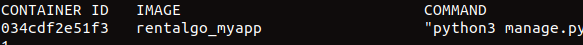
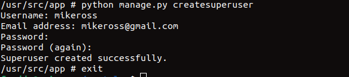

### cd into the project root directory
    $ cd rentalgo

Run 'docker-compose up'

    $ docker-compose up

### Open a new terminal and run 'docker ps -a'
    $ docker ps -a

### Copy the container id of rentalgo-myapp
 

### Then run ''
    $ docker exec -it CONTAINER_ID_HERE /bin/sh

### Create the superadmin of the project
    $ python manage.py createsuperuser

### Enter admin details and exit

### Go to localhost:8000 or 127.0.0.1:8000